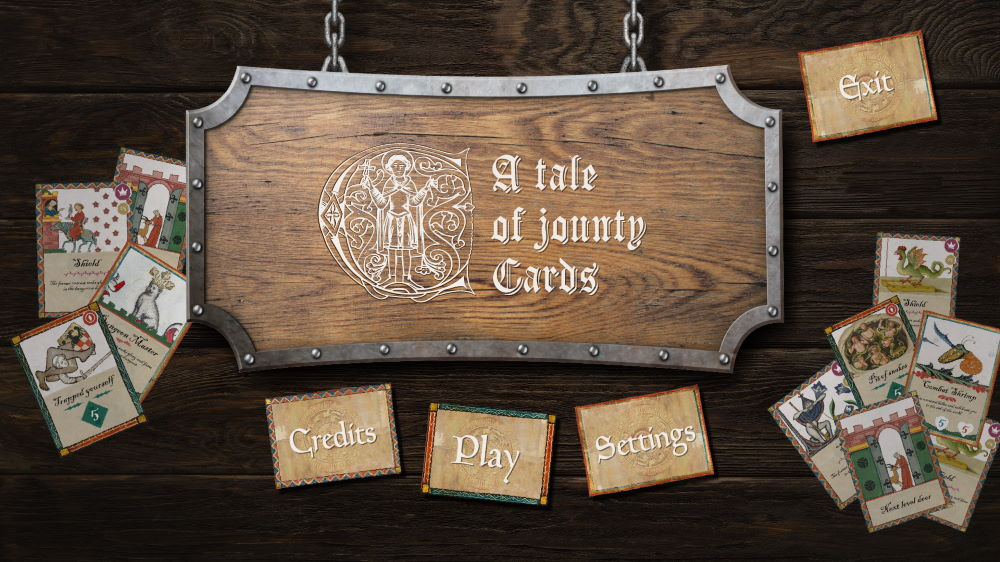
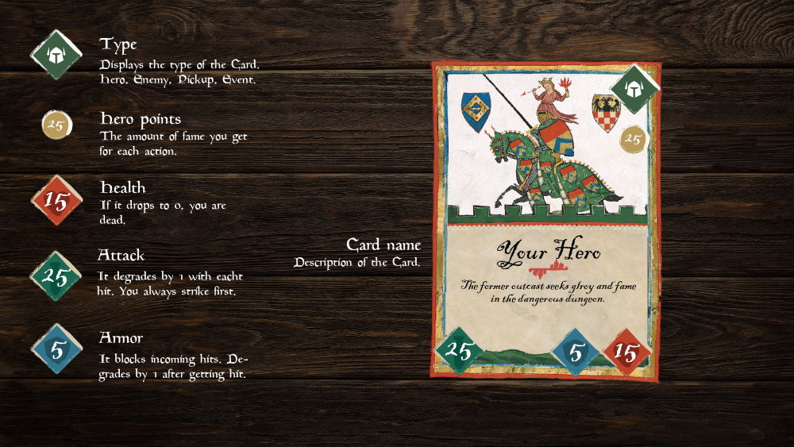
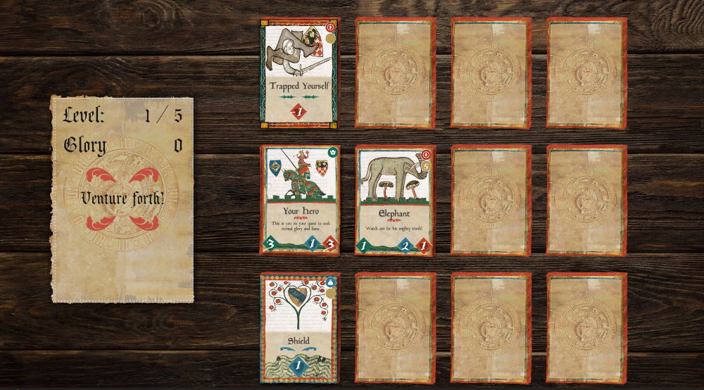
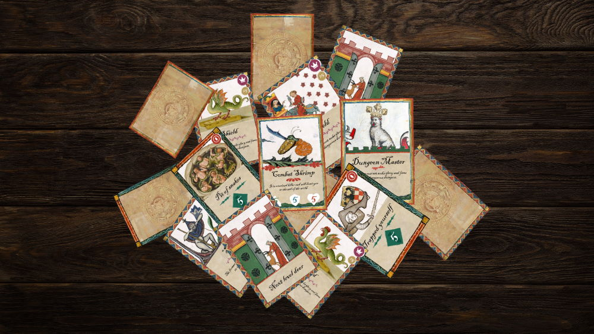

# A Tale of jaunty Cards

This game is a narrated rogue-like dungeon crawler card game set in medieval times. (with the possibility of converting it into an analog version).

Inhabitants from the medieval city of Rothenburg are seeking eternal fame and glory. They want to achieve this by exploring the dungeon from a seemingly abandoned castle near the city. However, the dungeon is owned by a lady who is not amused with their attempts to seek glory because they are ransacking her beautifully organized basement. Your goal is to guide one of these inhabitants to the end of the dungeon and hopefully amass enough Hero Points to be remembered for eternity.

Made during the [4th Klagenfurt Winter Jam](https://www.itec.aau.at/gamejam/) in cooperation with [Peter Hafele](http://peterhafele.com/), [Kalidor1](https://github.com/Kalidor1) and Rexipedia.

### [Play on itch.io](https://itch.io/jam/4th-winter-gamejam)

### [Download Executable](./Releases)

 

 

---

